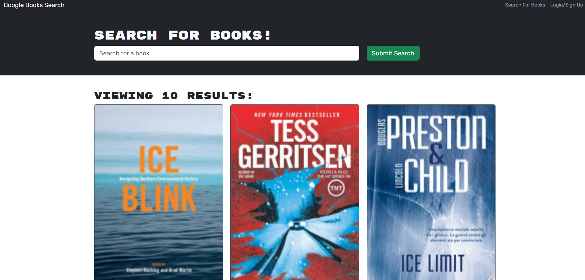

# Project Name: Book Search Engine

## Description
This app is a conversion from express to graphql, I would like yo uto know that this assignment isn't deployed 

## Installation 
npm run install
npm run build
npm run develop

## Usage 

This is a book search engine app that seeds the data through an api, it's got a save function and login for users.

## Screenshot

## Credits 
Tony Liu

## License 
MIT License

Copyright (c) 2023 loltony79

Permission is hereby granted, free of charge, to any person obtaining a copy
of this software and associated documentation files (the "Software"), to deal
in the Software without restriction, including without limitation the rights
to use, copy, modify, merge, publish, distribute, sublicense, and/or sell
copies of the Software, and to permit persons to whom the Software is
furnished to do so, subject to the following conditions:

The above copyright notice and this permission notice shall be included in all
copies or substantial portions of the Software.

THE SOFTWARE IS PROVIDED "AS IS", WITHOUT WARRANTY OF ANY KIND, EXPRESS OR
IMPLIED, INCLUDING BUT NOT LIMITED TO THE WARRANTIES OF MERCHANTABILITY,
FITNESS FOR A PARTICULAR PURPOSE AND NONINFRINGEMENT. IN NO EVENT SHALL THE
AUTHORS OR COPYRIGHT HOLDERS BE LIABLE FOR ANY CLAIM, DAMAGES OR OTHER
LIABILITY, WHETHER IN AN ACTION OF CONTRACT, TORT OR OTHERWISE, ARISING FROM,
OUT OF OR IN CONNECTION WITH THE SOFTWARE OR THE USE OR OTHER DEALINGS IN THE
SOFTWARE.

## Features

 GraphQL API built with Apollo Server that was once built with a RESTful API. 

## Share Remote Repository URL

https://github.com/loltony79/Book-Search-Engine
## DEPLOY

